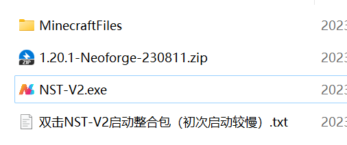
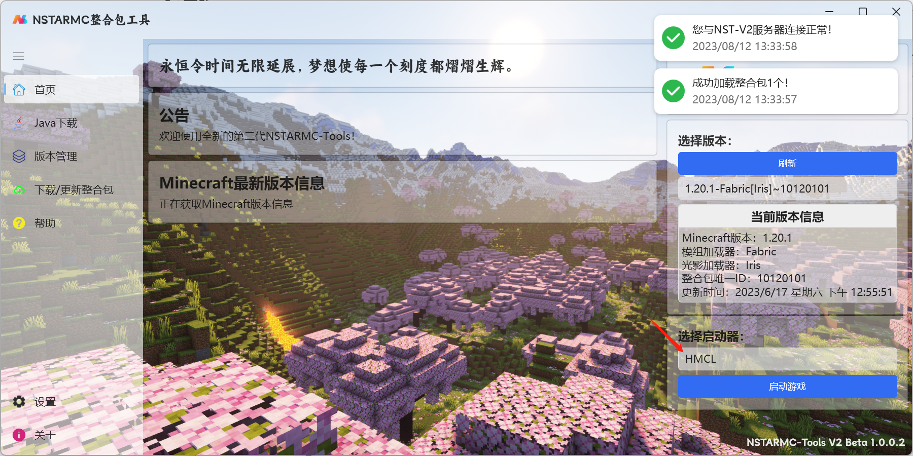

# NSTARMC基础模组整合包使用方法

# 下载

从网盘下载：[NSTAR系列基础模组整合包 - An Easy Cloud ](https://drive.dnxshare.cn/s/6OjFX)

从QQ频道下载：[加入频道](https://doc.nstarmc.cn/#/?id=QQ频道/群)

## 使用

下载完成后解压，你会获得以下文件

双击NST-V2，启动整合包自带的管理工具

?> 软件自带了.NET6.0环境，所以稍微有点大：）

然后选择你想用的启动器，启动即可

!> 本工具是半成品，很多东西还没做完

## 绕过整合包工具启动

打开以下文件夹即可找到启动器本体文件

