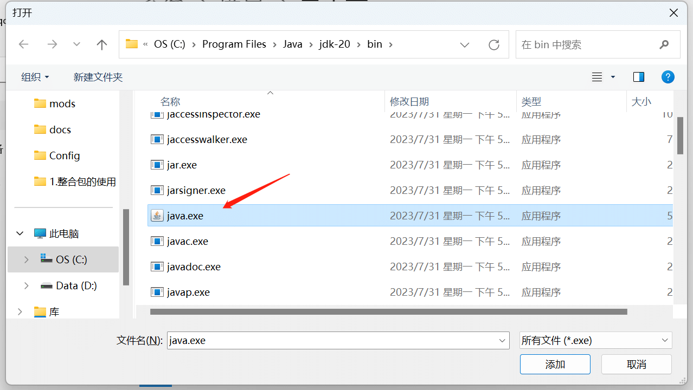
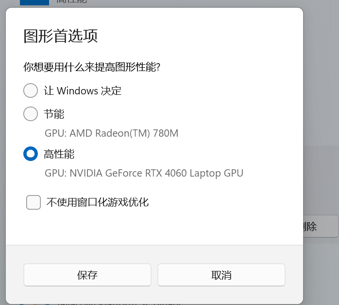

# 如何设置让Minecraft使用独立显卡

## 判断是否用了集成显卡

进入游戏（单人，多人都行），按F3，查看”显示卡“即可看到游戏用的哪一张显卡

如图，现在就是用的amd的核心显卡

## 方法1：启动独显直连

!> 注意：部分笔记本可能没有该功能，台式机的话，把HDMI/VGA插显卡上即可

一般来说，在笔记本自带的控制软件即可开启独显直连（一般游戏笔记本才有），这里一般需要重启电脑

或者，看看英伟达控制面板能不能切换（控制面板切换似乎不需要重启电脑，重启MC即可）

## 方法2：设置Java默认使用独立显卡

打开Windows设置，进入如图界面

进去后，点击”浏览“，然后选择你所使用的java（java.exe,javaw.exe)都要选上

然后在下面找到你选上的java和javaw

点击选项，设置为高性能，即可！

